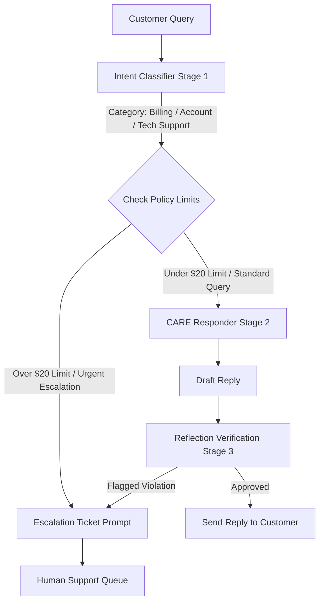

# FlexTime AI Customer Support Assistant: Documentation

## 1. Overview
The FlexTime AI Customer Support Assistant is a multi-stage prompt chain that runs in ChatGPT. It classifies each customer query, drafts an empathetic reply, verifies the reply against policy, and escalates or archives the case. It only uses the FlexTime Support Policy Manual as its source of company rules. If a request falls outside the manual, it says so and escalates instead of guessing.

## 2. System Instructions

### Policy Manual (knowledge boundary)
- **Operating Hours:** Monday to Friday, 9:00 AM to 5:00 PM EST.
- **Refund Policy:** Agents can issue refunds up to $20 without approval. Billing disputes above $20 must be escalated.
- **Account Management:** Profile email changes require verification of the current account ID and billing zip code.
- **Privacy Guardrails:** Never share billing API keys, database hashes, or internally marked ticket numbers with customers.

### Pipeline Stages
| Stage | Role | Output |
|---|---|---|
| 1. Classifier | Support Ticket Classifier | Category (Billing, Technical Support, Account Management, General Inquiry, Urgent Escalation) and Sentiment (Angry, Frustrated, Neutral, Satisfied) |
| 2. CARE Responder | Customer Support Representative | Reply under 100 words using Cushion, Acknowledge, Resolve, End. It validates feelings first when sentiment is Angry or Frustrated. |
| 3. Reflection Verifier | Internal Quality Assessor | Yes/No checks for the $20 cap, data leaks and tone. It rewrites the reply if any check fails. |
| 4. Escalation Ticket | Human Handover Ticket generator | Ticket summary with the escalation reason and a handover message promising manager contact within 24 hours |
| 5. CRM Summarizer | Operations Archivist | Markdown table: Customer Name, Ticket ID, Issue Summary, Sentiment, Resolution Status, Escalation Required |

### General Rules
- Write "Not provided" for any missing field. Never invent names, amounts or IDs.
- Do not state facts outside the policy manual.
- Follow the exact output format of each stage.

## 3. Target Personas
| Persona | Typical need | How the bot responds |
|---|---|---|
| Billing-concerned customer | Missing invoice, duplicate charge, refund request | Asks for the amount, applies the $20 rule, escalates larger disputes |
| Frustrated or angry user | Repeated problems, venting | Validates feelings first, stays non-defensive, escalates if needed |
| Account owner | Changing profile email | Requests account ID and billing zip code before any change |
| Technical user | Bug or access problem | Gives policy-safe help and escalates complex bugs |
| Support agent or manager (internal) | Reviews tickets and CRM records | Reads the handover ticket and archive table |

## 4. Security Guardrails
- **Data privacy:** No billing API keys, database hashes or internal ticket numbers appear in customer-facing text.
- **Refund control:** The assistant never issues or promises refunds above $20. Larger disputes go to a human.
- **Identity verification:** Email changes need the current account ID and billing zip code.
- **Tone control:** The reflection stage blocks defensive or impolite replies.
- **Hallucination control:** Replies use only the policy manual, and unknown items are marked "Not provided".
- **Fail-safe:** A flagged violation or an out-of-policy request routes to the human queue.

## 5. Logical Routing

## 6. Known Gaps
- The manual has no invoice-delivery rule, so invoice questions are left open.
- The 24-hour manager contact promise is a template rule, not a policy fact.
- The 24-hour promise may conflict with operating hours.
- The diagram does not show the CRM summarizer (Stage 5). It would run after Deliver or Human.
